# DataSet Description

Source: The dataset used is titled "Liquor_Brands.csv."
Description: This dataset contains details about different liquor brands and their relevant information. The columns include:
BRAND-NAME: The name of the liquor brand.
CT-REGISTRATION-NUMBER: A unique registration number for each brand.
STATUS: Current status of the brand registration.
EFFECTIVE and EXPIRATION: Effective and expiration dates of the brand registration.
OUT-OF-STATE-SHIPPER: Indicates whether the brand is an out-of-state shipper.

The URL = "https://catalog.data.gov/dataset/liquor-brands?fbclid=IwY2xjawGJl9lleHRuA2FlbQIxMAABHRbVnRT1uHewIpNYlHKnQQ5PPsx6KSBlYteF1PiZsbD7fqpOIGtrUADGFg_aem_QHsdP9nf8u52KLOMUTPkBg"
# Summary of Findings
Key patterns and trends identified from exploratory data analysis include:

Distribution of Wholesalers: The WHOLESALERS column showed a high concentration of brands with a relatively low number of wholesalers, with some having a significantly higher number of wholesalers.
Status Variability: The majority of brands were marked as “Active,” while others were marked differently, indicating potential discontinuation or reclassification.

# I. Import Libraries, Preferences, and Helper Functions
## Libraries
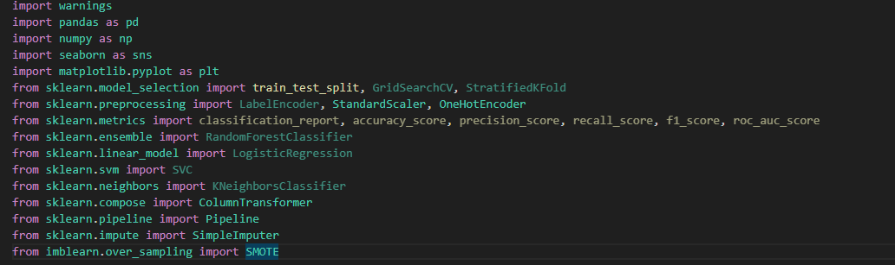
## Preferences
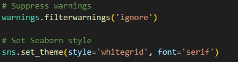
## Helper Functions
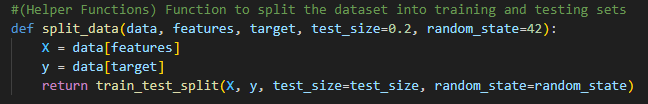
# II.Exploratory Data Analysis (EDA)
## Load the Dataset
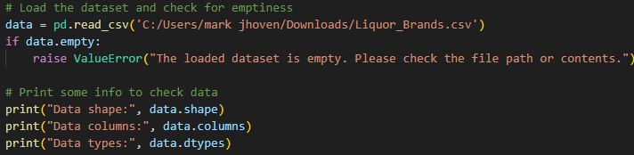
## Analyze Basic Statistics
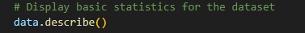
## Check for Missing Values
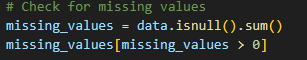
## Data Visualization
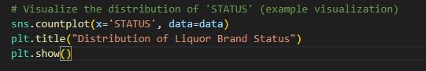
# III. Data Cleaning and Preprocessing
## Handle non-numeric values in numerical features BEFORE applying ColumnTransformer
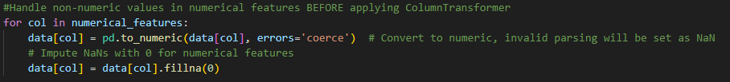
## Convert mixed types in categorical columns to string
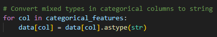
## Split data into training and testing sets
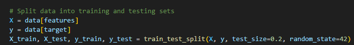
## Dynamically determine numerical and categorical features based on X_train data types
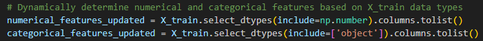
## Create pipelines for numerical and categorical features (Updated to handle missing after numeric conversion)
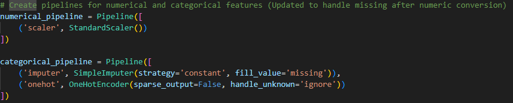
## Create ColumnTransformer using updated feature lists
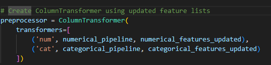
## Split data into training and testing sets
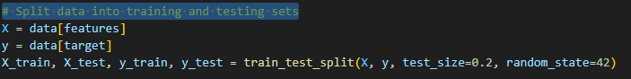
# Model Development
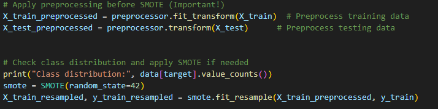
# Model Evaluation
The models were evaluated using Mean Squared Error (MSE) and R-squared scores.
Comparison: A comparison of these metrics indicated that Random Forest provided the most accurate predictions due to its ensemble nature and feature importance evaluation.
# Conclusion
Summary of Findings: The project revealed interesting insights into liquor brands, particularly focusing on the distribution and relationship between registration numbers and the number of wholesalers. The predictive models showed potential in identifying brands that are likely to have a higher number of wholesalers.
Practical Implications: This analysis can be used by companies and distributors to strategize and manage brands more effectively based on the identified trends.